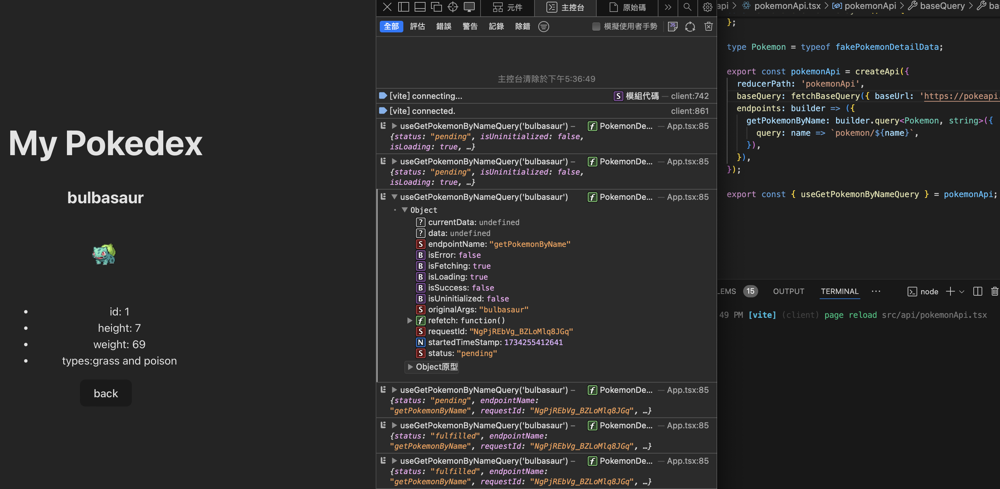

# RTK Query Practice

> This is a practice project to learn how to use RTK Query with Redux Toolkit. Code is based on the [Redux Toolkit Query Quick Start Guide](https://redux-toolkit.js.org/rtk-query/quick-start).

_Tips: Some of code is different for rtk version, some of the code is not working. So I replace from [https://redux-toolkit.js.org/tutorials/rtk-query](https://redux-toolkit.js.org/tutorials/rtk-query) and make it work._

## Setup

```
npm install redux react-redux @reduxjs/toolkit react-redux
```

## How to setup `RTK Query` in your project

1. Define a service (with api endpoints) with `createApi()` from rtk.

```typescript
// src/services/pokeminApi.ts
import { createApi, fetchBaseQuery } from '@reduxjs/toolkit/query/react';

export const pokemonApi = createApi({
  reducerPath: 'pokemonApi',
  baseQuery: fetchBaseQuery({ baseUrl: 'https://pokeapi.co/api/v2/' }),
  endpoints: builder => ({
    getPokemonByName: builder.query<Pokemon, string>({
      query: name => `pokemon/${name}`,
      keepUnusedDataFor: 60, // Keeps unused data in cache for 60 seconds
    }),
    getPokemonList: builder.query<List, void>({
      query: () => `pokemon?limit=10`,
    }),
  }),
});

export const { useGetPokemonByNameQuery, useGetPokemonListQuery } = pokemonApi;
```

**Note:** You can export `useXXX` as a hook to call the api in react component.

2. Add the `pokemonApi.reducer` to the store.

```typescript
import { configureStore } from '@reduxjs/toolkit';
import { pokemonApi } from './services/pokemonApi';

export const store = configureStore({
  reducer: {
    [pokemonApi.reducerPath]: pokemonApi.reducer,
  },
  middleware: getDefaultMiddleware =>
    getDefaultMiddleware().concat(pokemonApi.middleware),
});
```

3. Import `Provider` from `react-redux` and wrap the `App` component with it.

```tsx
import { Provider } from 'react-redux';
import { store } from './store';

ReactDOM.render(
  <Provider store={store}>
    <App />
  </Provider>,
  document.getElementById('root')
);
```

4. Use the `useGetPokemonByNameQuery` hook in the component.

```tsx
// src/app.tsx

import { useGetPokemonByNameQuery } from './services/pokemonApi';

function App() {
  const { data, error, isLoading } = useGetPokemonByNameQuery('bulbasaur');

  if (isLoading) return <div>Loading...</div>;
  if (error) return <div>Error: {error}</div>;

  return (
    <div>
      <h1>{data?.name}</h1>
      
    </div>
  );
}
```

**Hints:** Here's the screenshot of rtk-query in action.



You would find some props like:

- `isError`: boolean
- `isSuccess`: boolean
- `requestId`: string -- unique id for each request for caching
- `data`: any -- data returned from the api

**Hint:** Cache Setting for [here](https://redux-toolkit.js.org/rtk-query/usage/cache-behavior)

## Reference

1. [Redux Toolkit Query Quick Start Guide](https://redux-toolkit.js.org/tutorials/rtk-query)

2. [Comparison | React Query vs SWR vs Apollo vs RTK Query vs React Router](https://tanstack.com/query/v4/docs/framework/react/comparison) -- for further comparison modern state management libraries. You can refer to this link.
